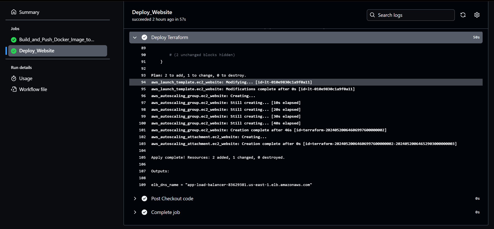
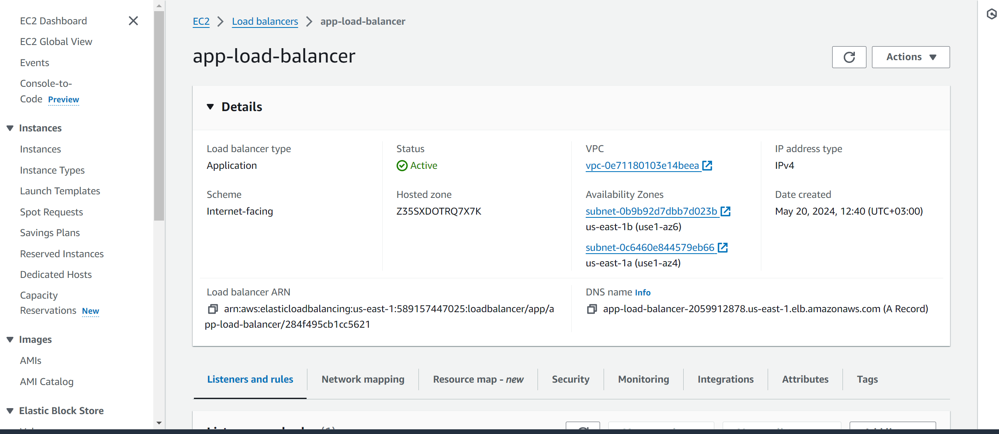
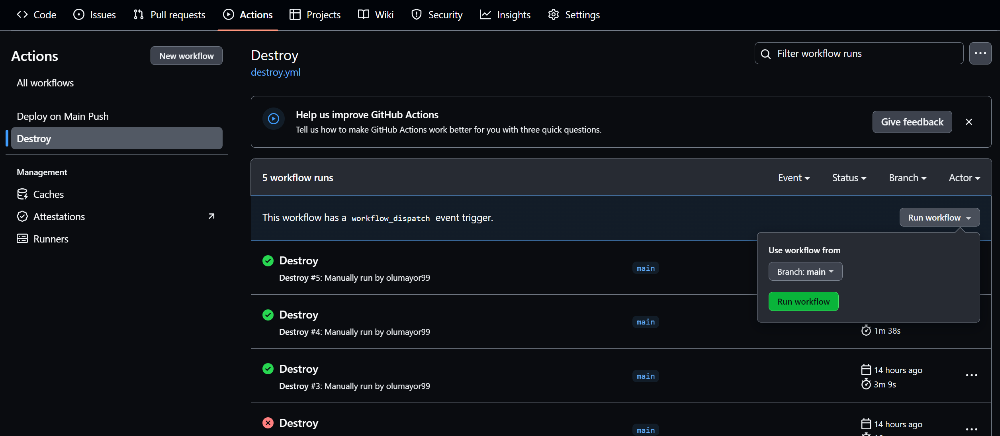

# Deploying a React Website to AWS EC2 using Terraform, Docker, and GitHub Actions

A task explaining the process of deploying a React website to an AWS S3 bucket using Terraform for infrastructure management and GitHub Actions for continuous deployment.

## Prerequisites
Before you begin, ensure you have the following:

1. An [AWS](https://aws.amazon.com) account. Free tier is okay.
2. [AWSCLI](https://docs.aws.amazon.com/cli/latest/userguide/getting-started-install.html) installed and configured on your machine.
3. [Terraform](https://developer.hashicorp.com/terraform/downloads) installed on your local machine.
4. [GitHub Account](https://github.com/) to use its repository for the project.
5. [Node.js and npm](https://www.freecodecamp.org/news/node-version-manager-nvm-install-guide/) installed on your local machine. Make sure you install node version 16.
6. A [DockerHub](https://hub.docker.com) account to store the built image.

## Project Structure
Here's an overview of the project structure:

```sh
$ tree
.
|-- Landing-Page-React
|   |-- Dockerfile
|   |-- README.md
|   |-- UltraDesktop.png
|   |-- UltraIPad.png
|   |-- UltraIPhone.png
|   |-- nginx.conf
|   |-- package-lock.json
|   |-- package.json
|   |-- public
|   |   |-- index.html
|   |   |-- manifest.json
|   |   `-- robots.txt
|   `-- src
|       |-- App.js
|       |-- components
|       |   |-- Footer
|       |   |   |-- Footer.elements.js
|       |   |   `-- Footer.js
|       |   |-- InfoSection
|       |   |   |-- InfoSection.elements.js
|       |   |   `-- InfoSection.js
|       |   |-- Navbar
|       |   |   |-- Navbar.elements.js
|       |   |   `-- Navbar.js
|       |   |-- Pricing
|       |   |   |-- Pricing.elements.js
|       |   |   `-- Pricing.js
|       |   |-- ScrollToTop.js
|       |   `-- index.js
|       |-- globalStyles.js
|       |-- images
|       |   |-- profile.jpg
|       |   |-- svg-1.svg
|       |   |-- svg-2.svg
|       |   `-- svg-3.svg
|       |-- index.css
|       |-- index.js
|       |-- pages
|       |   |-- HomePage
|       |   |   |-- Data.js
|       |   |   `-- Home.js
|       |   |-- Products
|       |   |   |-- Data.js
|       |   |   `-- Products.js
|       |   |-- Services
|       |   |   |-- Data.js
|       |   |   `-- Services.js
|       |   `-- SignUp
|       |       |-- Data.js
|       |       `-- SignUp.js
|       `-- reportWebVitals.js
|-- README.md
|-- Terraform
|   |-- main.tf
|   |-- outputs.tf
|   |-- providers.tf
|   `-- variables.tf
`-- assets
```

## Steps
1. Fork the repository to your GitHub account if you haven't already, and clone it to your local machine:

```sh
git clone <REPOSITORY>
```
2. Create an AWS access key in AWS IAM for Terraform with Administrator permissions (overkill, but just for this task). Download the generated CSV file, and run `aws configure` on your machine. Supply the access key and secret (copied from the CSV file) at the prompts.
3. Create an S3 bucket and DynamoDB table to use for state locking. You should create them through the AWS Dashboard. Use only stepd 2 and 5 of [this](https://terraformguru.com/terraform-real-world-on-aws-ec2/20-Remote-State-Storage-with-AWS-S3-and-DynamoDB/) guide. make sure you create them in the same region.
4. Open the [provider.tf](Terraform/provider.tf) file and replace the values of the `bucket` and `dynamodb_table` with the ones you just created, also making sure the `region` is correct. `key` can be any string, but make sure it has the `.tfstate` extension.

```groovy
backend "s3" {
    bucket         = "olatest-logger-lambda"
    key            = "terraform/s3_website/deployment.tfstate"
    region         = "us-east-1"
    dynamodb_table = "terraform-s3-backend-locking"
    encrypt        = true
  }
```
5. Open the [variable.tf](Terraform/variable.tf) file and replace the value of `s3_bucket_name` with a unique name. Remember, S3 buckets are globally unique, just like URLs.

```groovy
variable "s3_bucket_name" {
  type        = string
  default     = "erply-test-s3-website" #REPLACE
  description = "AWS S3 Bucket Name"
}
```
6. Go to the repository you forked in your GitHub account, and create the following repository secrets. Get their values from the IAM file (CSV) downloaded earlier, and also from the details of your DockerHub account:
   - AWS_ACCESS_KEY_ID 
   - AWS_SECRET_ACCESS_KEY
   - DOCKER_USERNAME
   - DOCKER_PASSWORD
7. Create an image repository in your DockerHub account. You can name it anything you want. Copy the full image repository name and put it in the sections signified with comments below. You can find this code in the [deploy.yml](.github/workflows/deploy.yml) workflow
  ```yaml
  jobs:
  
  
  Build_and_Push_Docker_Image_to_DockerHub:
    runs-on: ubuntu-latest

    steps:
      - name: Checkout
        uses: actions/checkout@v4

      - name: Build Docker image
        run: |
          cd Landing-Page-React
          docker build -t <REPLACE_ME> .

      - name: Log in to Docker Hub
        uses: docker/login-action@v3
        with:
          username: ${{ secrets.DOCKER_USERNAME }}
          password: ${{ secrets.DOCKER_PASSWORD }}

      - name: Push Docker image
        run: |
          docker push <REPLACE_ME>

  ```
8. Commit the code and push to the repository.

```sh
git add .
git commit -m "Pushed my code"
git push origin main
```
8. Go to the Actions tab in your repository, you'll see the `Deploy on Main Push` workflow running. Once the jobs finish successfully, click on the `Deploy Website` job, then click on the `Deploy Terraform` step and go to the end of the logs to see the `elb_dns_name`.
   


If you can't find it there, go to the LoadBalancers tab under EC2 in your AWS console, and look for a newly created Application Load Balancer matching the details of your VPC. Select the Load Balancer and look for the `DNS name` to find the URL of the Load Balancer.



Visiting the link in a browser should show a page exactly like this.


The React website should now be automatically deployed to your EC2 instances every time you push changes to the main branch.

## Pulling down the infrastructure
1. Go to the Actions tab of the repository, and on the left pane, click on `Destroy`, then on the right, click on `Run Workflow` dropdown, then click on the `Run Workflow` green button. It will take down the infrastructure provisioned by the pipeline.



2. Delete the S3 bucket and DynamoDB table created for state locking using the AWS console.

## Explanation of the workflow
This is the deploy.yml workflow. It triggers on every commit to the `main` branch of the repository. It sets the needed variables, some from GitHub secrets, and the rest supplied directly. It checks out the code, sets up `node` with version 16 (any other version won't work), and then it builds the code. The built code is stored in the `build` directory which it creates during the build process. The rest of the steps initialize and deploy the workload using terraform.

```yaml
name: Deploy on Main Push

on:
  push:
    branches:
      - main
env:
    AWS_ACCESS_KEY_ID: ${{ secrets.AWS_ACCESS_KEY_ID }}
    AWS_SECRET_ACCESS_KEY: ${{ secrets.AWS_SECRET_ACCESS_KEY }}
    AWS_DEFAULT_REGION: 'eu-north-1'

jobs:
  
  
  Build_and_Push_Docker_Image_to_DockerHub:
    runs-on: ubuntu-latest

    steps:
      - name: Checkout
        uses: actions/checkout@v4

      - name: Build Docker image
        run: |
          cd Landing-Page-React
          docker build -t olumayor99/doyenify-devops .

      - name: Log in to Docker Hub
        uses: docker/login-action@v3
        with:
          username: ${{ secrets.DOCKER_USERNAME }}
          password: ${{ secrets.DOCKER_PASSWORD }}

      - name: Push Docker image
        run: |
          docker push olumayor99/doyenify-devops

  Deploy_Website:
    needs: [Build_and_Push_Docker_Image_to_DockerHub]
    runs-on: ubuntu-latest
    
    steps:
    - name: Checkout code
      uses: actions/checkout@v4

    - name: Set up Terraform
      uses: hashicorp/setup-terraform@v3
      with:
        terraform_version: 1.8

    - name: Inititialize Terraform Code
      run: terraform -chdir=Terraform init -upgrade

    - name: Format Terraform Code
      run: terraform -chdir=Terraform fmt

    - name: Deploy Terraform
      run: terraform -chdir=Terraform apply -auto-approve
```

## Explanation of the Terraform code
The terraform code creates a VPC with two subnets, a LoadBalancer, an Autoscaling Group with a minimum of two EC2 instances, a Launch Template to specify the details and dependencies of the instances, an Internet Gateway and Route Tables for the VPC, a Security Group for the instances to only allow HTTP access from the Load Balancer, and a Security Group for the Load Balancer to allow external access.
The `user_data` section of the Launch Template also contains code for setting up the EC2 instances with docker, and a container running the React Website.

```groovy
# Create Launch Template
resource "aws_launch_template" "ec2_website" {
  name_prefix   = "${var.prefix}-launch-template"
  image_id        = data.aws_ami.ubuntu.id
  instance_type = "t2.micro"

  network_interfaces {
    associate_public_ip_address = true
    security_groups = [aws_security_group.instances.id]
  }

  user_data = base64encode(<<-EOF
            #!/bin/bash
            for pkg in docker.io docker-doc docker-compose docker-compose-v2 podman-docker containerd runc; do sudo apt-get remove -y $pkg; done
            sudo apt-get update
            sudo apt-get install -y ca-certificates curl
            sudo install -m 0755 -d /etc/apt/keyrings
            sudo curl -fsSL https://download.docker.com/linux/ubuntu/gpg -o /etc/apt/keyrings/docker.asc
            sudo chmod a+r /etc/apt/keyrings/docker.asc

            echo \
            "deb [arch=$(dpkg --print-architecture) signed-by=/etc/apt/keyrings/docker.asc] https://download.docker.com/linux/ubuntu \
            $(. /etc/os-release && echo "$VERSION_CODENAME") stable" | \
            sudo tee /etc/apt/sources.list.d/docker.list > /dev/null
            sudo apt-get update
            sudo apt-get install -y docker-ce docker-ce-cli containerd.io docker-buildx-plugin docker-compose-plugin
            sudo docker run -d -p 80:80 --name website olumayor99/doyenify-devops:latest

              EOF
  )

  tag_specifications {
    resource_type = "instance"
    tags = {
      Name = "ec2-website"
    }
  }
}
```

The `aws_ami` data source is necessary to automatically look for the Ubuntu 20.04 AMI in that region and automatically set its name, which can then be used in the Launch Template.

```groovy
# Get Ubuntu AMI in Region
data "aws_ami" "ubuntu" {

  most_recent = true

  filter {
    name   = "name"
    values = ["ubuntu/images/hvm-ssd/ubuntu-focal-20.04-amd64-server-*"]
  }

  filter {
    name   = "virtualization-type"
    values = ["hvm"]
  }

  owners = ["099720109477"]
}
```